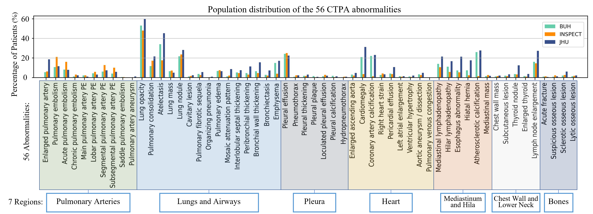
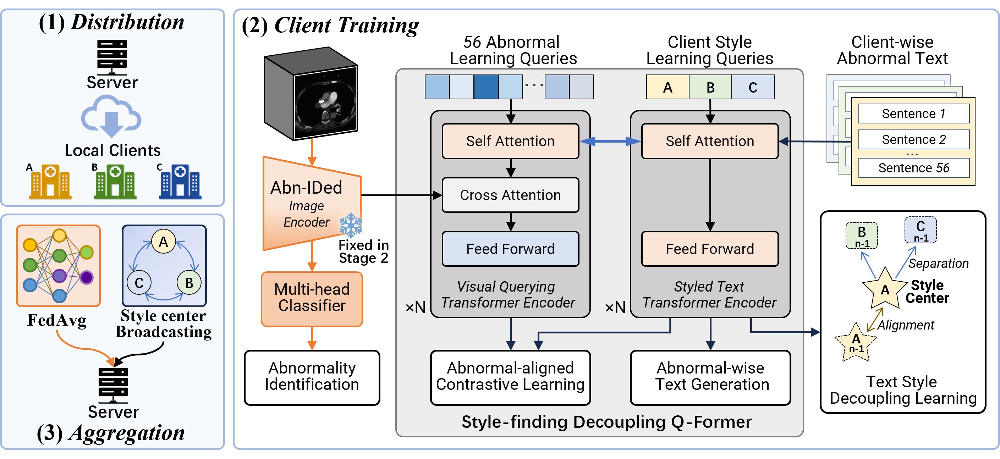
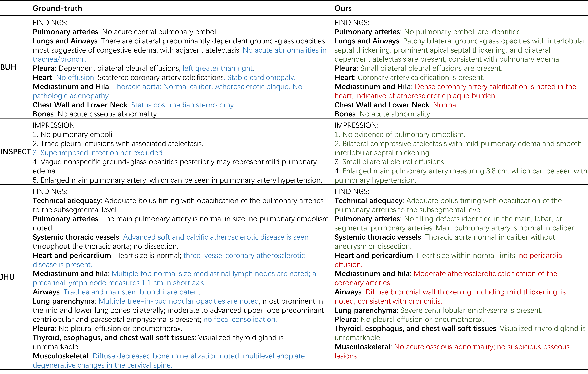

# Fed-BLIP: Federated Styled Report Generation with Abnormality-aligned Learning for CTPA

Official code release for the paper:

**Fed-BLIP: Federated Styled Report Generation with Abnormality-aligned Learning for CTPA**  
Zhusi Zhong, Yuli Wang, Sun Ho Ahn, Christopher J. Mullin, Colin F. Greineder, Michael K. Atalay, Scott Collins, Cheng Ting Lin, Qingyu Chen, Harrison X. Bai, Zhicheng Jiao

## Abstract

Medical report generation from computed tomography pulmonary angiography (CTPA) is important for pulmonary embolism diagnosis but remains challenging due to data privacy constraints and heterogeneous reporting styles across institutions. Existing vision-language models often generalize poorly because they struggle to capture fine-grained abnormality semantics and adapt to institution-specific reporting conventions. In this work, we propose Fed-BLIP, a federated learning framework for multi-center CTPA report generation that enables collaborative training without sharing raw data while preserving local reporting characteristics. The framework integrates multi-abnormality diagnosis and report generation, where a diagnosis module provides clinically grounded representations and a diagnosis-guided aggregation strategy regulates cross-center knowledge transfer. To address stylistic variability, we further introduce a style-finding disentanglement mechanism that separates reporting style from abnormality semantics, enabling more consistent and faithful generation under heterogeneous settings. Experiments on three multi-center CTPA datasets show that conventional pretrained and mixed-training methods are insufficient to handle cross-center variability, whereas Fed-BLIP achieves stronger and more stable performance in both language quality and clinical effectiveness. These results highlight the importance of jointly modeling diagnostic structure and reporting style for scalable, privacy-preserving medical report generation.


*Figure 1. Population distribution of the 56 CTPA abnormalities across three datasets (BUH, INSPECT, and JHU), grouped into seven anatomical regions: Pulmonary Arteries, Lungs and Airways, Pleura, Heart, Mediastinum and Hila, Chest Wall and Lower Neck, and Bones. These 56 abnormalities correspond to the key CTPA findings of interest defined in this work across the 7 report regions. Abnormality labels were extracted from radiology reports using a large language model, enabling a structured, region-wise characterization of inter-dataset variability relevant for CTPA report generation.*

## Overview

Fed-BLIP is a privacy-preserving federated framework for multi-center CTPA report generation.

This repository implements a **two-stage pipeline**:

1. **Stage 1 (federated abnormality classifier)**
   - Multi-center 3D CTPA abnormality classification (56 abnormality labels).
   - Per-client checkpointing and server-side personalized aggregation.

2. **Stage 2 (federated report generation)**
   - Feature-based federated BLIP-style training with style-aware report generation.
   - Generation of abnormality-level text, then optional LLM rewriting to Findings/Impression.


*Figure 2. Illustration of the proposed **Fed-BLIP** with three federated training stages: (1) Distribution: The server distributes the client Q-Former parameters to local clinical sites while fixing the pretrained Abn-IDed image encoder. (2) Client Training: Each institution trains its model using the proposed Style-finding Decoupling Q-Former (SD-QFormer), which contains two groups of learnable queries: (i) 56 abnormality learning queries fused via cross-attention to perform abnormality-aligned contrastive learning and guide abnormal-focused text generation; and (ii) client-specific style learning queries, which capture institution-dependent stylistic patterns through self-attention and are optimized using client-wise text style contrastive learning to separate reporting style from clinical content. (3) Aggregation: The server aggregates updated model parameters via Dia-fuse adaptive average while broadcasting client-specific style prototype, forming the next-round client models for redistribution.*

## Repository Structure

- `train_server_autoloop_stage1.py`: Stage-1 federated server (FastAPI).
- `train_client_autoloop_stage1.py`: Stage-1 federated client (DDP + HTTP polling).
- `train_stage1_base.py`: Stage-1 classifier backbone, data loading, local epoch logic.
- `1_run_clients_stage1.sh`: launcher for Stage-1 multi-client training.
- `2_test_stage1.py`: Stage-1 checkpoint testing.
- `3_extract_image_feat.py`: extract multi-scale image features from Stage-1 model.
- `4_make_stage2_ann_json.py`: build stage-2 JSON/JSONL annotations from extracted features.
- `train_server_autoloop_stage2.py`: Stage-2 federated server (FastAPI).
- `train_client_autoloop_stage2.py`: Stage-2 federated client (DDP + HTTP polling).
- `5_run_clients_stage2.sh`: launcher for Stage-2 multi-client training.
- `test_stage2_ddp.py`: Stage-2 DDP inference/generation.
- `6_run_test_stage2_ddp.sh`: launcher for Stage-2 distributed testing.
- `LLM_study_findings_writing_ddp.py`: optional study-level findings rewriting.
- `LLM_study_impression_writing_ddp.py`: optional impression rewriting from findings.

## Prompt Structure

The `prompts/` folder is organized into three parts:

1. **Task-level prompt wrappers**
   Files such as `prompts/writing_prompts.py` define the high-level instruction scaffold for each task.
   Each prompt typically contains:
   - a **System Role** describing the model as an expert thoracic radiologist,
   - a **Task** section defining the required output (`FINDINGS` or `IMPRESSION`),
   - an **Instructions** block specifying output constraints, content fidelity, and formatting rules,
   - a **Reporting Style Reference** placeholder such as `<TEMPLATE>`, and
   - a **Final Requirement** block that enforces plain-text, section-only output.

2. **Institution-specific style templates**
   Files such as `prompts/BUH_template.py`, `prompts/INSPECT_template.py`, and `prompts/JHU_template.py` provide center-specific reporting style references.
   These templates usually include:
   - the **section type** being generated,
   - a **section-level abstract template**,
   - **canonical content order**,
   - a **template skeleton** with region/section headings,
   - **language and style guidelines**, and
   - for impression generation, additional **phrase patterns**, **priority rules**, and **recommendation styles**.

3. **Inference backends**
   `prompts/rewrite_process_ollama.py` and `prompts/rewrite_process_llama3.py` define how prompts are sent to the underlying language model.
   In the current workflow, the prompt text is formed by inserting the institution-specific template into the generic wrapper, and then passed to the selected LLM backend for generation.

## Requirements

Recommended environment:

- Linux
- Python 3.10+
- CUDA-enabled GPUs
- PyTorch with CUDA

Main Python dependencies used in this codebase:

- `torch`, `torchvision`
- `monai`
- `numpy`, `pandas`, `openpyxl`
- `scikit-learn`
- `fastapi`, `uvicorn`, `requests`, `pydantic`
- `tqdm`, `timm`

For optional LLM post-processing scripts:

- Docker
- Ollama runtime / model serving (see `prompts/rewrite_process_ollama.py` usage in scripts)
- `prompts/rewrite_process_ollama.py` calls `from ollama import Client` and expects running Ollama endpoints on localhost ports (default mapping in code: GPU `i` -> `http://localhost:{11435+i}`).

### Create One Unified Conda Environment

```bash
conda env create -f environment.yml
conda activate fedblip
```

Minimal dependency lists are provided in:

- `requirements.txt` (core runtime)
- `requirements-optional.txt` (optional LLM/medical I/O extras)

## Data Preparation

### Important

Current code contains dataset-specific absolute paths (Brown / INSPECT / JHU) in:

- `datasets_utils/img_cls.py`

Before running on a new environment, update these paths to your local storage.

### Stage-1 input

Stage-1 expects center-specific metadata tables and split information (train/valid/test), plus CTPA volumes (`.nii.gz`) referenced by `image_id`.
It also uses `abntext` annotations: for each image/report, a set of **56 abnormality sentences** extracted from the radiology report (aligned with the 56 abnormality labels).

### Stage-2 input

Stage-2 uses two inputs generated after Stage-1:

1. **Feature files (`.npz`) from `3_extract_image_feat.py`**  
   Each sample is saved as a multi-scale feature package, including `pooled_scale_1`, `pooled_scale_2`, `pooled_scale_3`, `pooled_scale_4`, and `scale_5`.  
   These tensors are the direct visual input to the Stage-2 model.

2. **Annotation JSON files from `4_make_stage2_ann_json.py`**  
   These files map each feature path to case metadata and supervision fields (e.g., accession ID, 56-label abnormality vector, and abnormality text entries).

In short, Stage-2 trains/tests on **pre-extracted visual features + JSON supervision**, instead of loading raw CTPA volumes.

After running feature extraction + JSON building, each center typically has:

- `stage1_img_feat/<CENTER>/train|valid|test/.../*.npz`
- `stage1_img_feat/<CENTER>/anno_file_train.json`
- `stage1_img_feat/<CENTER>/anno_file_valid.json`
- `stage1_img_feat/<CENTER>/anno_file_test.json`

`ImgFeatCapDataset` supports JSONL and JSON list formats.

## Quick Start

### 1) Stage-1 federated training

Start server:

```bash
python train_server_autoloop_stage1.py
```

Start clients (multi-center launcher):

```bash
bash 1_run_clients_stage1.sh
```

Check logs:

```bash
tail -f fed_logs/*.log
```

Stop clients:

```bash
pkill -f train_client_autoloop_stage1.py
```

### 2) Stage-1 testing (optional)

```bash
python 2_test_stage1.py
```

### 3) Extract Stage-2 features and build annotation files

```bash
python 3_extract_image_feat.py
python 4_make_stage2_ann_json.py
```

### 4) Stage-2 federated training

Start server:

```bash
python train_server_autoloop_stage2.py
```

Start clients:

```bash
bash 5_run_clients_stage2.sh
```

### 5) Stage-2 testing / generation

```bash
bash 6_run_test_stage2_ddp.sh
```

Results are saved under:

- `stage2_test_result/round_<ROUND>/<CLIENT>/output_results_abn_text_probs.jsonl`


### 6) Optional LLM rewriting (Findings / Impression)

Before running these scripts, make sure Ollama services are already running and reachable at the ports used by `prompts/rewrite_process_ollama.py`.

Findings rewriting:

```bash
bash 7_run_selected_exps_LLM_finding.sh
```

Impression rewriting:

```bash
bash 8_run_selected_exps_LLM_impress.sh
```

### Qualitative examples

The following figure shows representative Stage-2 qualitative examples, comparing full ground-truth (`GT`) and generated (`Pred`) reports from three centers.


*Figure 5. Qualitative comparison of CTPA report generation results. The generated reports generally preserve the section structure and reporting conventions of each center, while major findings are also well captured. Nevertheless, the model still exhibits hallucinations, omissions, and structural inconsistencies across anatomical sections. <b><span style="color:green">Green</span></b> indicates correct findings, <b><span style="color:red">red</span></b> denotes hallucinated or misplaced statements, and <b><span style="color:blue">blue</span></b> highlights omitted findings compared to the reference report.*

## Checkpoints

- INSPECT training parameters / checkpoint: `TBD (link will be added after upload)`


## Citation

If you use this code, please cite:

```bibtex
@article{zhong2023fedblip,
  title={Fed-BLIP: Federated Styled Report Generation with Abnormality-aligned Learning for CTPA},
  author={Zhong, Zhusi and Wang, Yuli and Ahn, Sun Ho and Mullin, Christopher J. and Greineder, Colin F. and Atalay, Michael K. and Collins, Scott and Lin, Cheng Ting and Chen, Qingyu and Bai, Harrison X. and Jiao, Zhicheng},
  journal={IEEE Transactions on Medical Imaging},
  year={2023}
}
```

## Acknowledgments

Parts of the distributed utilities and modeling interfaces are adapted from open-source vision-language and medical imaging tooling (including LAVIS/MONAI-style components) as reflected in the source files.
